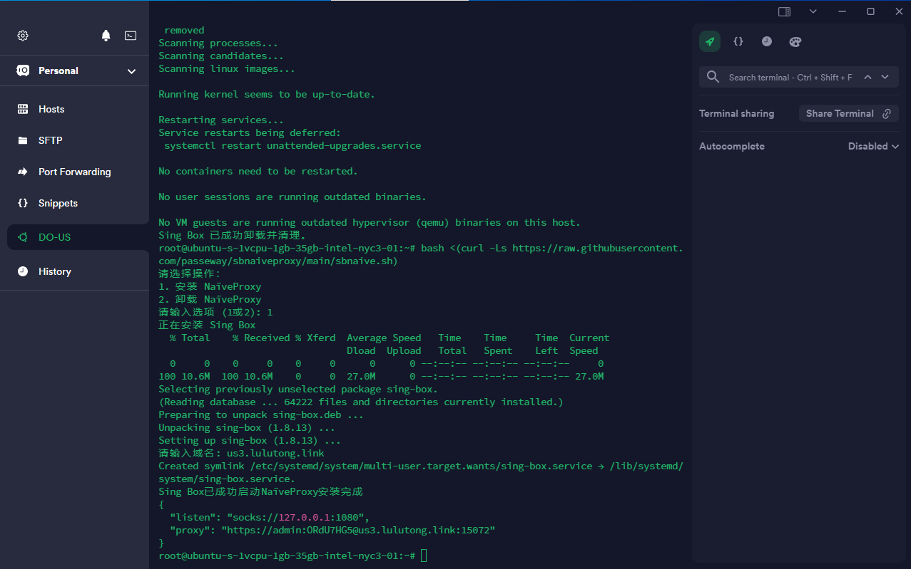

## 预览



## 一键脚本
```bash
bash <(curl -Ls https://raw.githubusercontent.com/passeway/sbnaiveproxy/main/sbnaive.sh)
```
## 安装
下载sing-box
```
bash <(curl -fsSL https://sing-box.app/deb-install.sh)
```
修改/etc/sing-box/config.json
```
nano /etc/sing-box/config.json
```
```
{
  "log": {
    "level": "info",
    "timestamp": true,
    "output": "/var/log/singbox.log"
  },
  "inbounds": [
    {
      "type": "naive",
      "tag": "naive-in",
      "listen": "::",
      "listen_port": 443,
      "tcp_fast_open": true,
      "users": [
        {
          "username": "your_username",
          "password": "your_password"
        }
      ],
      "tls": {
        "enabled": true,
        "server_name": "example.com",
        "acme": {
          "domain": ["example.com"],
          "data_directory": "/usr/local/etc/sing-box",
          "email": "admin@gmail.com",
          "provider": "letsencrypt"
        }
      }
    }
  ],
  "outbounds": [
    {
      "type": "direct",
      "tag": "direct-out"
    }
  ]
}
```
查看config.json
```
cat /etc/sing-box/config.json
```
检查config.json
```
sing-box check -c /etc/sing-box/config.json
```
启动config.json
```
sing-box run -c /etc/sing-box/config.json
```
启动系统服务
```
systemctl enable sing-box
```
启动sing-box
```
systemctl start sing-box
```
停止sing-box
```
systemctl stop sing-box
```
重启sing-box
```
systemctl restart sing-box
```
查看sing-box
```
systemctl status sing-box
```
查看sing-box日志
```
cat /var/log/singbox.log
```
查看sing-box证书
```
ls /usr/local/etc/sing-box/certificates/acme-v02.api.letsencrypt.org-directory/
```


## 卸载
禁用 Sing Box
```
sudo systemctl stop sing-box
sudo systemctl disable sing-box
```
卸载 Sing Box
```
sudo apt-get remove --purge sing-box -y
```
删除 Sing Box
```
sudo rm -rf /etc/sing-box
sudo rm -f /var/log/singbox.log
sudo rm -rf /usr/local/etc/sing-box
```
重载 systemd
```
sudo systemctl daemon-reload
```

